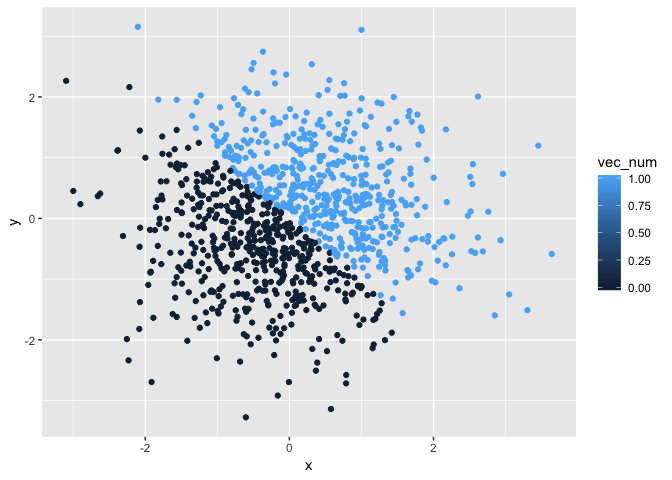

p8105\_hw1\_hx2263
================
Tiffany Xi
2018-09-15

*Problem 1*

``` r
## create data frame
df_1 = tibble(
  random_samp = runif(n = 10, min = 0, max = 5),
  vec_logical = random_samp > 2,
  vec_char = paste(c("X"), 1:10, sep = ""),
  vec_factor = factor(c("male", "male", "female", "female", "male", "female", "female", "male", "female", "male"))
)
df_1 
```

    ## # A tibble: 10 x 4
    ##    random_samp vec_logical vec_char vec_factor
    ##          <dbl> <lgl>       <chr>    <fct>     
    ##  1       4.11  TRUE        X1       male      
    ##  2       3.16  TRUE        X2       male      
    ##  3       2.99  TRUE        X3       female    
    ##  4       3.91  TRUE        X4       female    
    ##  5       0.856 FALSE       X5       male      
    ##  6       0.321 FALSE       X6       female    
    ##  7       0.431 FALSE       X7       female    
    ##  8       3.62  TRUE        X8       male      
    ##  9       3.78  TRUE        X9       female    
    ## 10       0.400 FALSE       X10      male

``` r
mean(df_1$random_samp)
```

    ## [1] 2.356986

``` r
mean(df_1$vec_logical)
```

    ## [1] 0.6

``` r
mean(df_1$vec_char)
```

    ## Warning in mean.default(df_1$vec_char): argument is not numeric or logical:
    ## returning NA

    ## [1] NA

``` r
mean(df_1$vec_factor)
```

    ## Warning in mean.default(df_1$vec_factor): argument is not numeric or
    ## logical: returning NA

    ## [1] NA

\*What works and what doesn’t? Why?

Numeric sample and logical vector works, while character vector and factor vector doesn't. Because arithmetic operation, such as mean, will fail when using character and factor vector, only works for numeric or logical vector. Numerical samples are real number set. Logical values of TRUE or FALSE always have the numeric value of 1 or 0. Character variables are set of strings.

``` r
## create dataframe and convert var into numeric
df_2 = tibble(
  random_samp = runif(n = 10, min = 0, max = 5),
  vec_logical = as.numeric(random_samp > 2),
  vec_char = as.numeric(paste(c("X"), 1:10, sep = "")),
  vec_factor = as.numeric(factor(c("male", "male", "female", "female", "male", "female", "female", "male", "female", "male")))
)
df_2 
```

\*What happens?

When applying as.numeric, factors will return the numeric codes that correspond to the factor levels and logical values of TRUE or FALSE will return the corresponding numeric value of 1 or 0. But character vectors will generate NAs introduced by coercion.

``` r
## create data frame and do dual conversion
df_3 = tibble(
  vec_char = as.numeric(as.factor(paste(c("X"), 1:10, sep = ""))),
  vec_factor = as.numeric(as.character(factor(c("male", "male", "female", "female", "male", "female", "female", "male", "female", "male"))))
)
```

    ## Warning in eval_tidy(xs[[i]], unique_output): NAs introduced by coercion

``` r
df_3 
```

    ## # A tibble: 10 x 2
    ##    vec_char vec_factor
    ##       <dbl>      <dbl>
    ##  1        1         NA
    ##  2        3         NA
    ##  3        4         NA
    ##  4        5         NA
    ##  5        6         NA
    ##  6        7         NA
    ##  7        8         NA
    ##  8        9         NA
    ##  9       10         NA
    ## 10        2         NA

\*What happens?

Double type conversion represents the nested functions in R, in which you pass the results of one function to a second function. Still, factors return the numeric codes that correspond to the factor levels but character vectors generate NAs introduced by coercion.

*Problem 2*

``` r
#create new data frame
df_4 = tibble(
  x = rnorm(n = 1000),
  y = rnorm(n = 1000),
  vec_log = x + y > 0,
  vec_num = as.numeric(vec_log),
  vec_fac = as.factor(vec_log)
)

#Make scatterplot of y vs x, color points using the logical variable
#red stands for FLASE in vec_log, blue stands for TRUE in vec_log
ggplot(df_4, aes(x = x, y = y, color = vec_log)) + geom_point()
```


``` r
ggsave("scatter_plot_1.pdf", height = 4, width = 6)

#scatterplot that color points using the numeric variables
#dark blue stands for value 0, light blue stands for 1 in vec_num which is TRUE in vec_log
ggplot(df_4, aes(x = x, y = y, color = vec_num)) + geom_point()
```



``` r
#scatterplot that color points using the factor variables
#red stands for FLASE in vec_fac, blue stands for TRUE in vec_fac
ggplot(df_4, aes(x = x, y = y, color = vec_fac)) + geom_point()
```

 Description: The newly created dataset has 5 columns and 1000 rows. The mean of random sample x is 0.0360319 and the median of x is 0.0107187. The proportion of cases for which the logical vector is TRUE is 0.501
